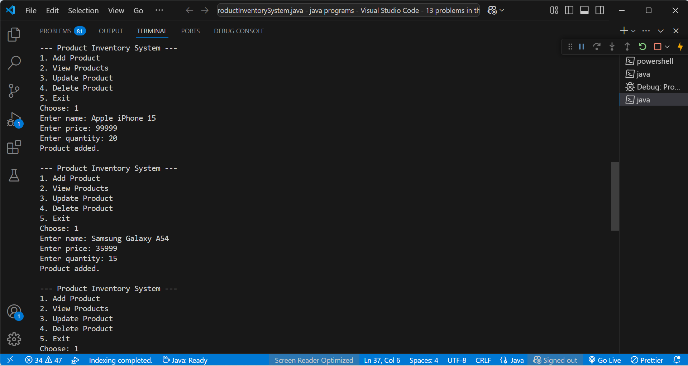
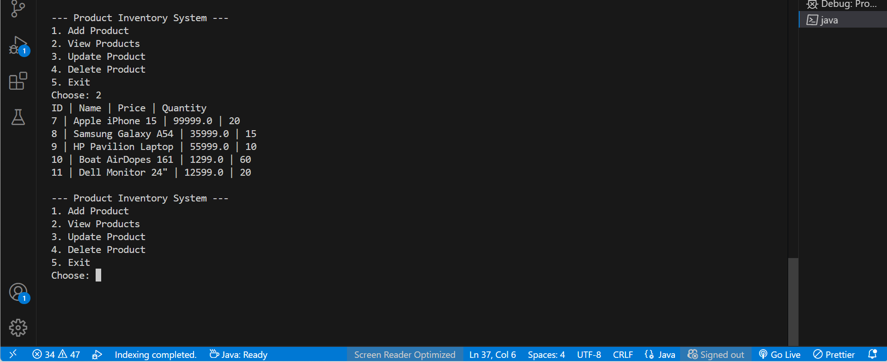
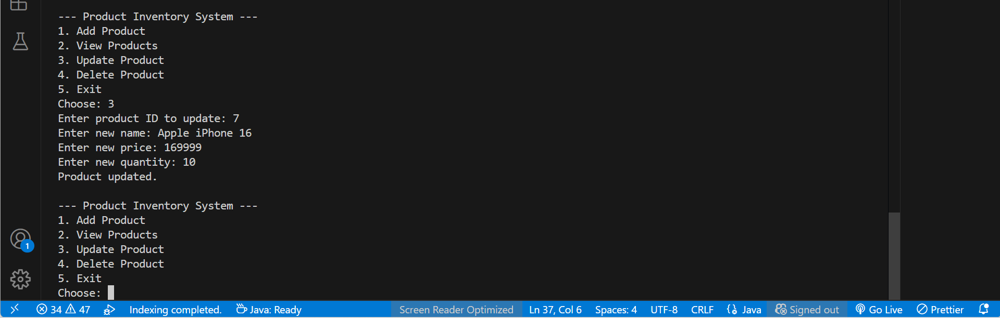
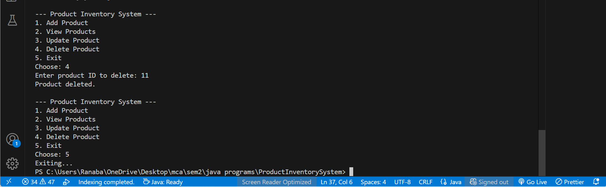

# AJWP_Anudip_Project
# 📦 Product Inventory System (JDBC + MySQL)

This is a simple **Product Inventory Management System** built using **Java**, **JDBC**, and **MySQL**. It allows users to perform basic **CRUD operations** (Create, Read, Update, Delete) on a product database.

---

## 🚀 Features

- Add new products
- View all products
- Update product details
- Delete products
- MySQL database connection via JDBC
- Menu-driven console UI

---

## 🧰 Technologies Used

- Java
- JDBC (Java Database Connectivity)
- MySQL
- Command-line interface

---

#OUTPUT

========= Product Inventory System =========
1. Add Product
2. View Products
3. Update Product
4. Delete Product
5. Exit
Enter your choice: 1

Enter product name: Apple iPhone 15
Enter price: 89999
Enter quantity: 10
✅ Product added successfully!

========= Product Inventory System =========
1. Add Product
2. View Products
3. Update Product
4. Delete Product
5. Exit
Enter your choice: 2

📋 List of Products:
---------------------------------------------------------
ID   | Name                      | Price     | Quantity
---------------------------------------------------------
1    | Apple iPhone 15           | 89999.0   | 10

========= Product Inventory System =========
1. Add Product
2. View Products
3. Update Product
4. Delete Product
5. Exit
Enter your choice: 3

========= Product Inventory System =========
1. Add Product
2. View Products
3. Update Product
4. Delete Product
5. Exit
Enter your choice: 4

